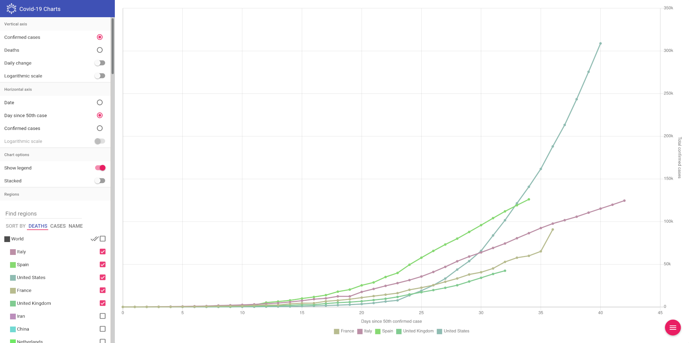

# corona

This is a Covid-19 cases visualisation app using CSSE data built with EmberJS. It runs completely in the browser and does not require a backend server.

Access the [live instance](https://corona.njoyard.fr) of this app.

## About this app

This app was largely inspired by Benjamin Ooghe Tabanou's [Coronavirus Country Comparator](https://boogheta.github.io/coronavirus-countries/).

### Data sources

Data comes from the [Center for Systems Science and Engineering (CSSE)](https://systems.jhu.edu/) at Johns Hopkins University. It is [released openly](https://github.com/CSSEGISandData/COVID-19/tree/master/csse_covid_19_data/csse_covid_19_time_series) and updated daily. They used it to build a [very nice dashboard](https://gisanddata.maps.arcgis.com/apps/opsdashboard/index.html#/bda7594740fd40299423467b48e9ecf6), please also check it out.

The app uses the latest version available at the time of loading. Just refresh the page to get updated data.

Finally, please note that this data uses officially reported figures, and is only indicative of the actual situation. They come from various organizations and countries, and may use different counting methods. Actual figures are most likely higher.

### License and developer info

The code for this app is released under the terms of the [MIT license](https://raw.githubusercontent.com/njoyard/corona/master/LICENSE).

Made with ♥ using [EmberJS](https://emberjs.com), [Ember Paper](https://miguelcobain.github.io/ember-paper) and [ChartJS](https://chartjs.org).

## Development

### Prerequisites

- [Node.js](https://nodejs.org/) (with npm and yarn, `npm install -g yarn`)
- [Ember CLI](https://ember-cli.com/) (`npm install -g ember-cli`)

### Installation

- `git clone https://github.com/njoyard/corona` this repository
- `cd corona`
- `yarn`

### Running / Development

- `ember s`
- Visit your app at [http://localhost:4200](http://localhost:4200).
- Visit your tests at [http://localhost:4200/tests](http://localhost:4200/tests).

#### Linting

- `npm run lint:hbs`
- `npm run lint:js`
- `npm run lint:js -- --fix`

#### Building

- `ember build` (development)
- `ember build --environment production` (or `yarn build`) (production)

Build output is stored in the `dist` folder. Use any web server to serve the contents of this directory to deploy your version of the app.
