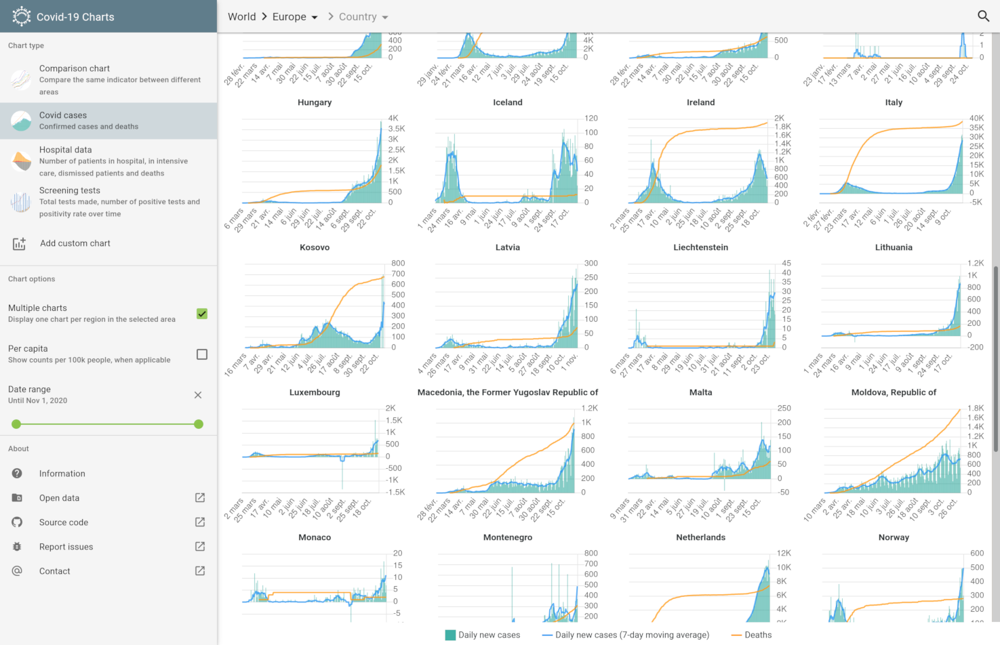

# corona

This is a Covid-19 cases visualisation app using CSSE and French Government data built with EmberJS. It runs completely in the browser and does not require a backend server.

Access the [live instance](https://corona.njoyard.fr/) of this app.

## About this app

### Data sources

- [Center for Systems Science and Engineering (CSSE) at Johns Hopkins University](http://github.com/CSSEGISandData/COVID-19/tree/master/csse_covid_19_data/csse_covid_19_time_series)
- [European Centre for Disease Prevention and Control (ECDC)](http://www.ecdc.europa.eu/en/publications-data/download-data-hospital-and-icu-admission-rates-and-current-occupancy-covid-19)
- [Santé Publique France on the data.gouv.fr platform](http://www.data.gouv.fr/fr/datasets/donnees-hospitalieres-relatives-a-lepidemie-de-covid-19/)

### License and developer info

The code for this app is released under the terms of the [MIT license](https://raw.githubusercontent.com/njoyard/corona/master/LICENSE).

Made with ♥ using [EmberJS](https://emberjs.com), [Ember Paper](https://miguelcobain.github.io/ember-paper) and [ChartJS](https://chartjs.org).

## Development

### Prerequisites

- [Node.js](https://nodejs.org/) (with npm and yarn, `npm install -g yarn`)
- [Ember CLI](https://ember-cli.com/) (`npm install -g ember-cli`)

### Installation

- `git clone https://github.com/njoyard/corona` this repository
- `cd corona`
- `yarn`

### Running / Development

- Run `DEV_OUTPUT=true yarn crunch` to generate the dataset
- Run `ember s` to start the development server
- Visit your app at [http://localhost:4200](http://localhost:4200).
- Visit your tests at [http://localhost:4200/tests](http://localhost:4200/tests).

#### Linting

- `npm run lint:hbs`
- `npm run lint:js`
- `npm run lint:js -- --fix`

#### Building

- `ember build` (development)
- `ember build --environment production` (or `yarn build`) (production)

Build output is stored in the `dist` folder. Use any web server to serve the contents of this directory to deploy your version of the app.
